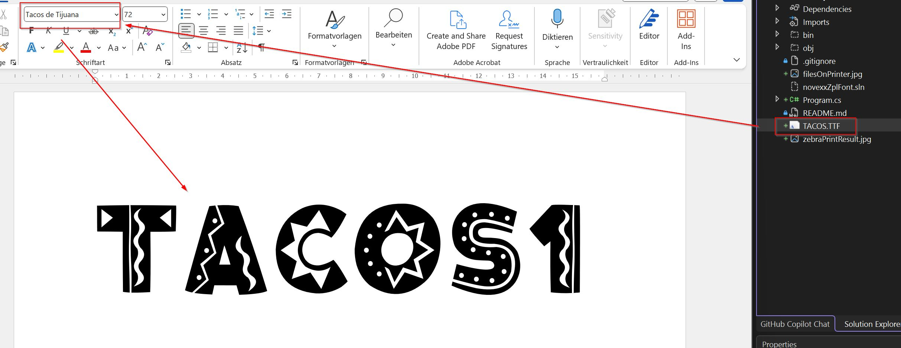
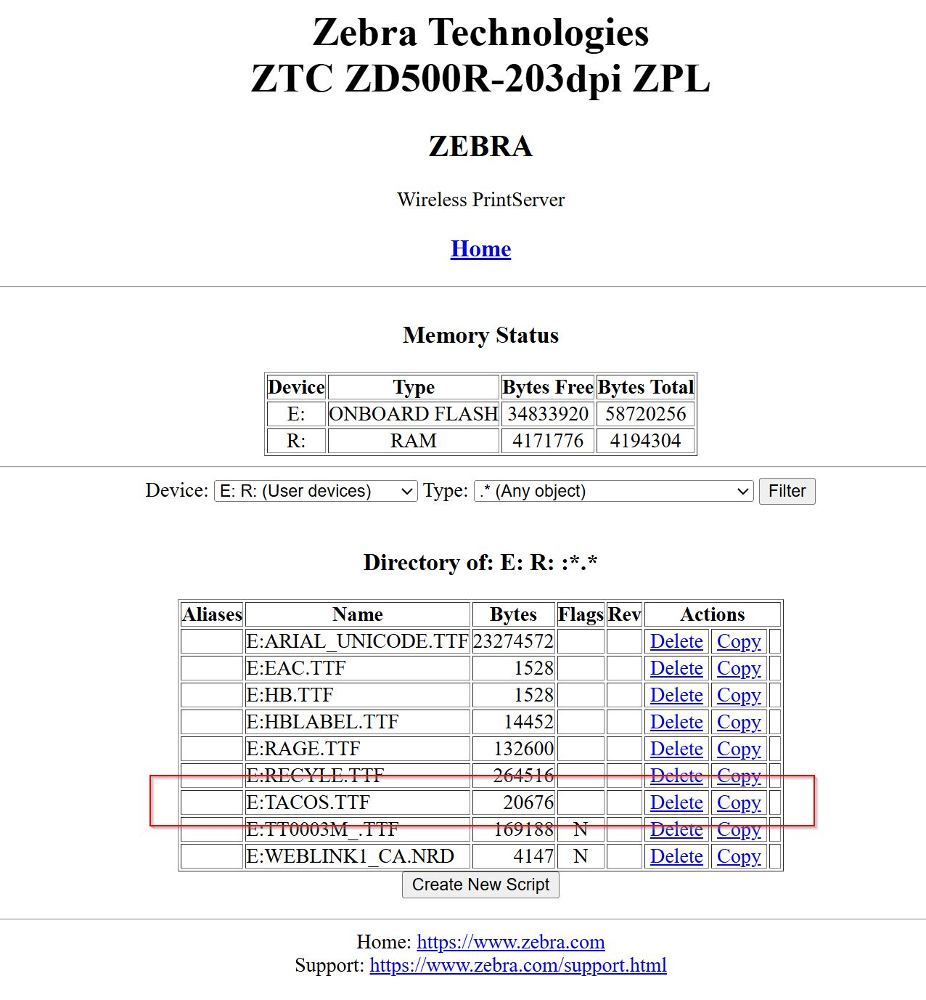
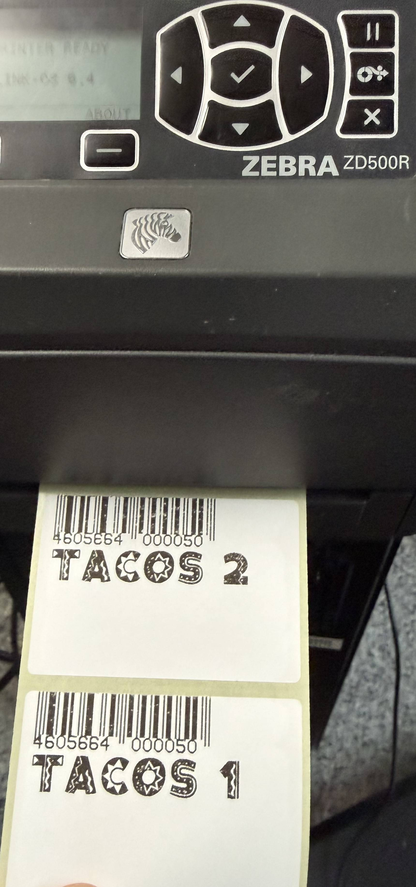

# This is for Novexx Support as Example/Reference how TTF Fonts easy used with Zebra ZPL

This code demonstrates uploads a TTF to printer, makes 2 labels and prints it. 

## Printer used
- Zebra ZD500R 203dpi via Wifi (Firmaware V74.20.23Z)  

## Example Code 
.NET Core 10 Console App

## .NET Nuget Package used
- Neodynamic.SDK.ThermalLabel Version 14.0.25.1111 (2025-11-17)

## Font used (from Line 39 - Program.cs)
https://www.dafont.com/de/tacos-de-tijuana.font

## Font uploaded to Zebra Printer (from Line 8 - Program.cs)

## Labels printed (from Line 80 - Program.cs)

## ZPL printstream
<a href="printstream.txt">zpl commands/printstream</a> (1,28kb) 

